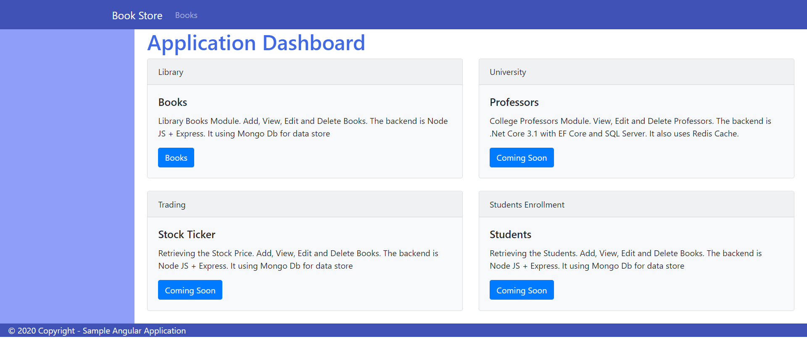
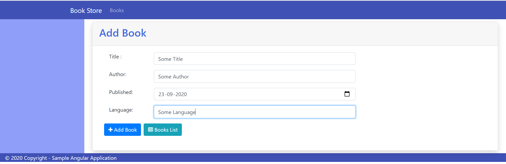
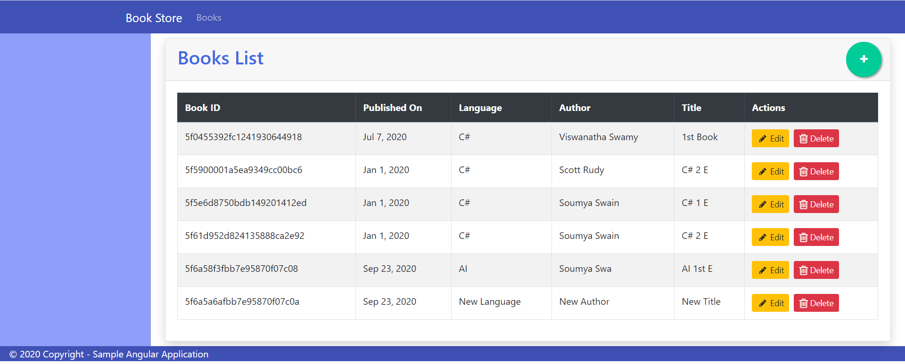
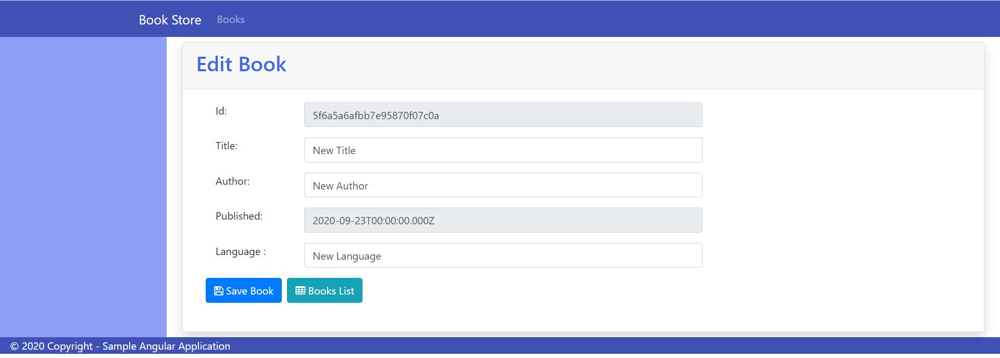
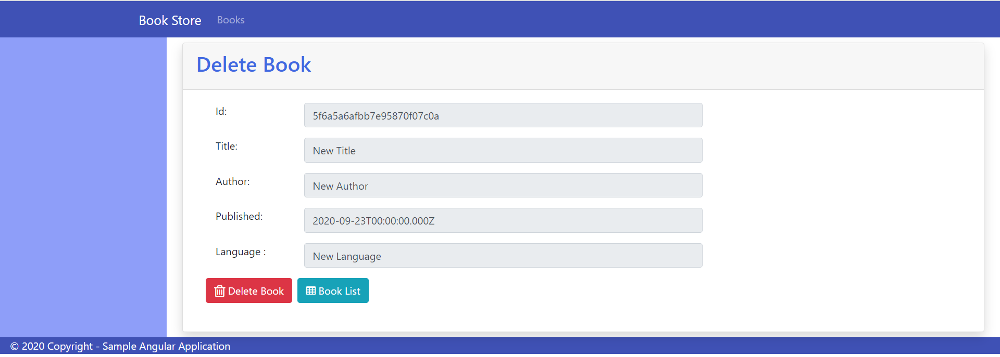
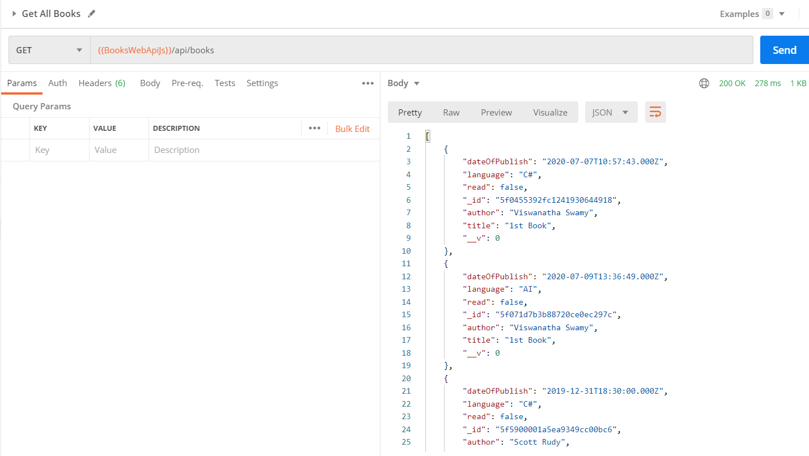

This is a Simple MEAN Stack application for Book Store which performs all the CRUD operations where:
 
<b>C</b> - Create/Add a book  
<b>R</b> - Read the book entries from the database(MongoDB Atlas)  
<b>U</b> - Update the book details  
<b>D</b> - Delete the book entries
  
This project is part of my 1 Month Industrial Training of MEAN Stack Development from <a href="https://webteklabs.com/">WebTek Labs, Delhi.</a>
 
## Application Looks and Feel

### Angular 10 UI

'
'
'
'
'

### Web API

## Technologies Used

1. Node JS + Express Web API
2. Angular 10 UI
3. Mongo Db [Atlas](https://cloud.mongodb.com/)
